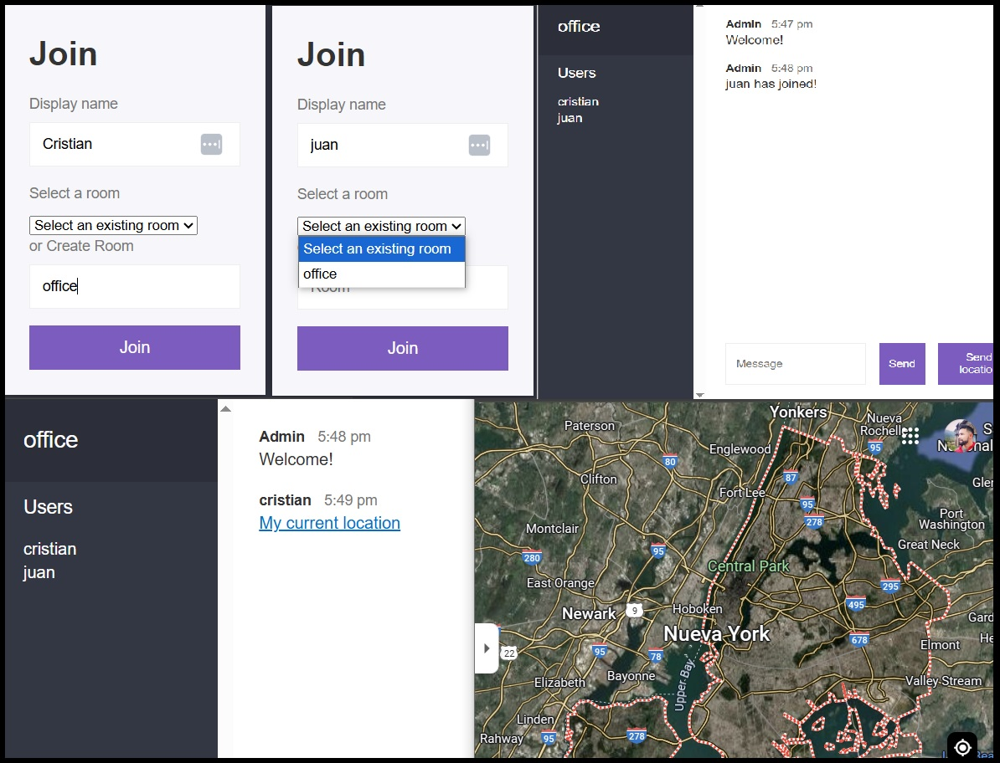

# 💬 Chat App

Aplicación de chat en tiempo real desarrollada con Node.js, Express y Socket.io. Permite a múltiples usuarios comunicarse en salas de chat usando WebSockets.

## 🚀 Tecnologías utilizadas

- [Node.js](https://nodejs.org/)
- [Express](https://expressjs.com/)
- [Socket.io](https://socket.io/)
- [Handlebars](https://handlebarsjs.com/) (para plantillas)
- [JavaScript](https://developer.mozilla.org/es/docs/Web/JavaScript)
- HTML & CSS

## 📸 Captura de pantalla

## 🛠️ Instalación y uso local

1. Cloná este repositorio:
   git clone https://github.com/ariascm/chat-app.git
   cd chat-app

2. Instalá las dependencias:
    npm install

3. Iniciá el servidor:
    npm start

4. Abrí tu navegador en:
    http://localhost:3000

## 🔧 Funcionalidades

    * Envío y recepción de mensajes en tiempo real
    * Unirse a salas de chat con nombre de usuario
    * Sistema básico de ubicación en el mapa (opcional)
    * Gestión de usuarios conectados

## 📂 Estructura del proyecto

chat-app/
   ├── public/           # Archivos estáticos (JS, CSS, HTML)
   ├── src/              # Lógica del servidor (Express + Socket.io)
   ├── views/            # Plantillas Handlebars
   ├── package.json
   └── README.md

## 👤 Autor
   Cristian Arias
   GitHub - @ariascm
